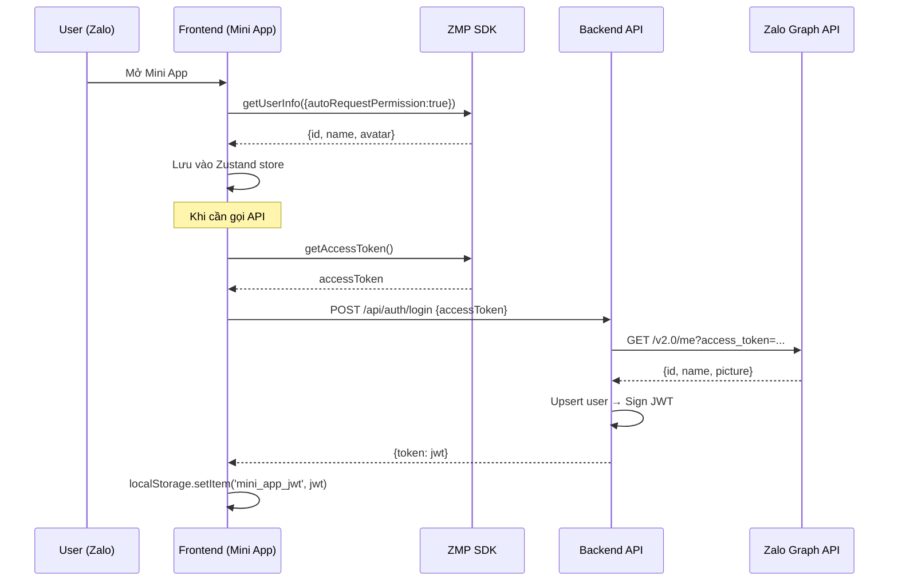

# 📋 Kiểm tra Compliance Zalo Mini App — Dự án Phường Tùng Thiện

> **Phiên bản:** v1 — 23/06/2026
> **Phạm vi:** Kiểm tra toàn diện việc tuân thủ yêu cầu kỹ thuật, quy tắc, và best practices của Zalo Mini App Platform
> **Lưu ý:** Bỏ qua các yêu cầu chỉ áp dụng cho production deployment (theo yêu cầu)

---

## 1. Cấu hình `app-config.json`

**File:** [app-config.json](file:///d:/2025/src/zalo_mini_app_test/my-app-test-1/app-config.json)

### 1.1. Kiểm tra các thuộc tính bắt buộc

| Thuộc tính | Giá trị hiện tại | Yêu cầu Zalo | Đánh giá |
|---|---|---|---|
| `app.title` | `"Phường Tùng Thiện"` | **Bắt buộc** (string) | ✅ Đạt |
| `app.headerColor` | `"#246BFD"` | Optional (hex code) | ✅ Đạt |
| `app.statusBarColor` | `"#246BFD"` | ⚠️ Không phải thuộc tính chuẩn | ⚠️ Xem bên dưới |
| `app.textColor` | `"white"` | Optional (`"white"` hoặc `"black"`) | ✅ Đạt |
| `app.statusBar` | `"normal"` | Optional (`normal`/`hidden`/`transparent`) | ✅ Đạt |
| `app.actionBarHidden` | `true` | Optional (boolean) | ✅ Đạt — phù hợp vì app tự custom header |

### 1.2. Vấn đề phát hiện

> [!WARNING]
> **`statusBarColor` không phải thuộc tính chuẩn** theo tài liệu chính thức Zalo Mini App.
> Tài liệu chỉ hỗ trợ: `headerColor` (dùng cho cả thanh trạng thái khi `statusBar: "normal"`).
> `statusBarColor` có thể bị **bỏ qua** bởi Zalo framework → màu status bar không đúng ý muốn.

**Cải thiện:**
- [ ] Xóa `statusBarColor` khỏi config (vì `headerColor` đã áp dụng cho cả status bar khi `statusBar: "normal"`)
- [ ] Nếu cần dark mode, sử dụng Zalo Theme format:
  ```json
  "headerColor": { "light": "#246BFD", "dark": "#1A1A2E" },
  "textColor": { "light": "white", "dark": "white" }
  ```

### 1.3. Thiếu `leftButton` config

Hiện tại không khai báo `leftButton`. Vì `actionBarHidden: true` nên điều này **không ảnh hưởng** (action bar đã ẩn). ✅ OK.

### 1.4. Khai báo `pages` — Đồng bộ với routes

| Trang trong `pages` | Route trong `app.tsx` | Khớp? |
|---|---|---|
| `/feedback` | `<Route path="/feedback" .../>` | ✅ |
| `/feedback-create` | `<Route path="/feedback-create" .../>` | ✅ |
| `/feedback-detail` | `<Route path="/feedback-detail" .../>` | ✅ |
| `/booking` | `<Route path="/booking" .../>` | ✅ |
| `/booking-create` | `<Route path="/booking-create" .../>` | ✅ |
| `/heritage` | `<Route path="/heritage" .../>` | ✅ |
| `/heritage-detail` | `<Route path="/heritage-detail" .../>` | ✅ |
| `/rating` | `<Route path="/rating" .../>` | ✅ |
| `/events` | `<Route path="/events" .../>` | ✅ |
| `/events-detail` | `<Route path="/events-detail" .../>` | ✅ |
| `/education` | `<Route path="/education" .../>` | ✅ |
| `/planning` | `<Route path="/planning" .../>` | ✅ |
| `/services` | `<Route path="/services" .../>` | ✅ |
| `/social-security` | `<Route path="/social-security" .../>` | ✅ |
| `/health` | `<Route path="/health" .../>` | ✅ |
| `/profile` | `<Route path="/profile" .../>` | ✅ |
| `/quiz` | `<Route path="/quiz" .../>` | ✅ |
| `/quiz-take` | `<Route path="/quiz-take" .../>` | ✅ |
| `/quiz-result` | `<Route path="/quiz-result" .../>` | ✅ |
| `/dvc` | `<Route path="/dvc" .../>` | ✅ |
| `/ihanoi` | `<Route path="/ihanoi" .../>` | ✅ |
| `/vneid` | `<Route path="/vneid" .../>` | ✅ |
| `/ttdt` | `<Route path="/ttdt" .../>` | ✅ |
| ❌ Thiếu `/` | `<Route path="/" .../>` (trang chủ) | ❌ **Thiếu** |

> [!CAUTION]
> **Trang chủ `/` không được khai báo trong `pages`!**
> Theo yêu cầu Zalo, tất cả các route mà Mini App sử dụng nên được liệt kê trong `pages` array. Trang chủ `/` — route quan trọng nhất — đang bị thiếu.

**Cải thiện:**
- [ ] Thêm `"/"` vào đầu mảng `pages` trong `app-config.json`

---

## 2. Sử dụng ZMP SDK APIs

### 2.1. Các API đang sử dụng

| API | File sử dụng | Mục đích | Đánh giá |
|---|---|---|---|
| `getUserInfo` | [zaloHelper.ts:L5](file:///d:/2025/src/zalo_mini_app_test/my-app-test-1/src/utils/zaloHelper.ts#L5) | Lấy thông tin user (id, name, avatar) | ⚠️ Xem 2.2 |
| `getAccessToken` | [zaloHelper.ts:L13](file:///d:/2025/src/zalo_mini_app_test/my-app-test-1/src/utils/zaloHelper.ts#L13) | Lấy access token cho xác thực backend | ⚠️ Xem 2.3 |
| `getPhoneNumber` | [zaloHelper.ts:L23](file:///d:/2025/src/zalo_mini_app_test/my-app-test-1/src/utils/zaloHelper.ts#L23) | Lấy token phone number | ✅ Đúng pattern |
| `openChat` | [BottomNav.tsx:L65](file:///d:/2025/src/zalo_mini_app_test/my-app-test-1/src/components/BottomNav.tsx#L65), [index.tsx:L204](file:///d:/2025/src/zalo_mini_app_test/my-app-test-1/src/pages/index/index.tsx#L204) | Mở chat với Zalo OA | ✅ Đạt |
| `openWebview` | [zaloHelper.ts:L36](file:///d:/2025/src/zalo_mini_app_test/my-app-test-1/src/utils/zaloHelper.ts#L36) | Mở URL bên ngoài (DVC, VNeID, iHanoi) | ⚠️ Xem 2.4 |
| `getLocation` | [feedback/create.tsx:L53](file:///d:/2025/src/zalo_mini_app_test/my-app-test-1/src/pages/feedback/create.tsx#L53) | Lấy GPS cho phản ánh hiện trường | ✅ Đạt — có `authorize` trước |
| `chooseImage` | [feedback/create.tsx:L64](file:///d:/2025/src/zalo_mini_app_test/my-app-test-1/src/pages/feedback/create.tsx#L64) | Chọn ảnh đính kèm | ✅ Đạt |
| `authorize` | [feedback/create.tsx:L52](file:///d:/2025/src/zalo_mini_app_test/my-app-test-1/src/pages/feedback/create.tsx#L52) | Yêu cầu quyền vị trí | ✅ Đạt |

### 2.2. `getUserInfo` — `autoRequestPermission: true`

**File:** [zaloHelper.ts:L5](file:///d:/2025/src/zalo_mini_app_test/my-app-test-1/src/utils/zaloHelper.ts#L5)

```typescript
const { userInfo } = await getUserInfo({ autoRequestPermission: true });
```

> [!NOTE]
> **Đánh giá:** `autoRequestPermission: true` sẽ tự động hiện popup yêu cầu quyền truy cập thông tin người dùng ngay khi mở app. Theo Zalo Mini App Guidelines:
> - ✅ Đây là cách dùng chấp nhận được
> - ⚠️ Tuy nhiên, Zalo **khuyến nghị** chỉ yêu cầu quyền khi thực sự cần thiết (lazy permission request) để UX tốt hơn
> - Hiện tại, `fetchUser()` được gọi ngay trong `useEffect` ở `MyApp` component ([app.tsx:L31](file:///d:/2025/src/zalo_mini_app_test/my-app-test-1/src/app.tsx#L31)), nghĩa là **luôn request permission ngay khi mở app**

**Khuyến nghị:**
- [ ] Cân nhắc chuyển `autoRequestPermission: false` và chỉ request khi user thực sự tương tác (ví dụ: khi mở trang profile)
- [ ] Hoặc giữ nguyên nếu app cần hiển thị tên user ngay trên trang chủ (citizen card) — đây là lý do hợp lý

### 2.3. `getAccessToken` — Luồng xác thực cần kiểm tra

**File:** [zaloHelper.ts:L13-L20](file:///d:/2025/src/zalo_mini_app_test/my-app-test-1/src/utils/zaloHelper.ts#L13-L20)

```typescript
export async function getZaloAccessToken(): Promise<string | null> {
  try {
    const accessToken = await getAccessToken();
    return accessToken as string;
  } catch (error) {
    console.error('Error fetching Access Token:', error);
    return null;
  }
}
```

> [!IMPORTANT]
> **Phân tích luồng auth:**
>
> 1. Frontend gọi `getAccessToken()` từ ZMP SDK → nhận được **Zalo access token**
> 2. Gửi access token tới backend `/api/auth/login`
> 3. Backend dùng token gọi `https://graph.zalo.me/v2.0/me` để xác thực
> 4. Backend tạo JWT riêng và trả về cho frontend
>
> **Đây là luồng auth ĐÚNG** theo tài liệu Zalo. ✅

**Lưu ý quan trọng:**
- `getAccessToken()` trả về giá trị có thể không phải string (ZMP SDK trả về object). Code hiện tại dùng `as string` cast — cần đảm bảo kiểu trả về đúng theo phiên bản SDK đang dùng
- Nên kiểm tra log khi chạy trên Zalo app thật để xác nhận giá trị trả về

### 2.4. `openWebview` — Fallback logic cho web

**File:** [zaloHelper.ts:L33-L49](file:///d:/2025/src/zalo_mini_app_test/my-app-test-1/src/utils/zaloHelper.ts#L33-L49)

```typescript
export function openExternalUrl(url: string, title?: string) {
  try {
    openWebview({ url, config: { style: 'normal' } });
    // Fallback for PC web emulation
    const isWeb = /Chrome|Safari|Firefox|Edge/i.test(navigator.userAgent) && !/Zalo/i.test(navigator.userAgent);
    if (isWeb) {
      window.open(url, '_blank');
    }
  } catch (error) {
    window.open(url, '_blank');
  }
}
```

> [!NOTE]
> **Đánh giá:**
> - ✅ `openWebview` với `style: 'normal'` là cách dùng đúng theo SDK docs
> - ✅ Fallback `window.open` cho môi trường web dev là hợp lý
> - ⚠️ `title` parameter không được sử dụng — `openWebview` API của Zalo **không hỗ trợ** tham số `title` trong config object, nên không ảnh hưởng

**Cải thiện nhỏ:**
- [ ] Xóa tham số `title` không sử dụng khỏi function signature để tránh nhầm lẫn

### 2.5. `getPhoneNumber` — Triển khai đúng nhưng chưa sử dụng

**File:** [zaloHelper.ts:L23-L31](file:///d:/2025/src/zalo_mini_app_test/my-app-test-1/src/utils/zaloHelper.ts#L23-L31)

- Function `requestPhoneNumber()` đã được export nhưng **không có file nào import/sử dụng**
- Theo quy trình Zalo: `getPhoneNumber` trả về **token**, sau đó cần gửi token lên server → server gọi Zalo Social API `/v2.0/me/info` để giải mã số điện thoại thật

> [!NOTE]
> Hiện tại form feedback và booking yêu cầu user **tự nhập** số điện thoại thủ công.
> Nếu muốn tích hợp auto-fill phone number:
> 1. Gọi `getPhoneNumber()` trên frontend
> 2. Gửi token về backend
> 3. Backend gọi Zalo API decode ra SĐT thật
> 4. Hiển thị SĐT cho user xác nhận

**Khuyến nghị:**
- [ ] Tích hợp `requestPhoneNumber()` vào form feedback/booking để auto-fill SĐT, cải thiện UX và đảm bảo SĐT chính xác
- [ ] Hoặc xóa function nếu không có kế hoạch sử dụng (tránh dead code)

---

## 3. ZMP UI Components — Tích hợp chính xác

### 3.1. Sử dụng component framework

| Component | Sử dụng | Đánh giá |
|---|---|---|
| `<App>` | [app.tsx:L35](file:///d:/2025/src/zalo_mini_app_test/my-app-test-1/src/app.tsx#L35) | ✅ Root component đúng |
| `<ZMPRouter>` | [app.tsx:L37](file:///d:/2025/src/zalo_mini_app_test/my-app-test-1/src/app.tsx#L37) | ✅ Router component đúng |
| `<AnimationRoutes>` | [app.tsx:L38](file:///d:/2025/src/zalo_mini_app_test/my-app-test-1/src/app.tsx#L38) | ✅ Animated page transitions |
| `<SnackbarProvider>` | [app.tsx:L36](file:///d:/2025/src/zalo_mini_app_test/my-app-test-1/src/app.tsx#L36) | ✅ Toast notifications |
| `<Page>` | Tất cả pages | ✅ Page wrapper |
| `<BottomNavigation>` | [BottomNav.tsx:L47](file:///d:/2025/src/zalo_mini_app_test/my-app-test-1/src/components/BottomNav.tsx#L47) | ✅ Tab bar |
| `<Box>`, `<Text>` | Khắp nơi | ✅ Layout primitives |
| `<Input>`, `<Select>` | Forms | ✅ Form components |
| `<DatePicker>` | [booking/create.tsx:L156](file:///d:/2025/src/zalo_mini_app_test/my-app-test-1/src/pages/booking/create.tsx#L156) | ✅ Date selection |
| `<Modal>` | [quiz/take.tsx](file:///d:/2025/src/zalo_mini_app_test/my-app-test-1/src/pages/quiz/take.tsx) | ✅ Dialog |
| `<Spinner>` | DVC, VNeID, iHanoi pages | ✅ Loading indicator |
| `<Button>` | Nhiều pages | ✅ Action buttons |
| `<Tabs>` | [feedback/index.tsx](file:///d:/2025/src/zalo_mini_app_test/my-app-test-1/src/pages/feedback/index.tsx) | ✅ Tab navigation |

**Đánh giá tổng thể:** ✅ **Tốt** — Dự án sử dụng đầy đủ ZMP UI components thay vì tự custom, đảm bảo tương thích native look-and-feel trên Zalo.

### 3.2. Import CSS đúng

**File:** [main.tsx:L4](file:///d:/2025/src/zalo_mini_app_test/my-app-test-1/src/main.tsx#L4)

```typescript
import 'zmp-ui/zaui.css';
```

✅ **Đạt** — CSS của ZMP UI được import đúng cách.

---

## 4. Routing & Navigation

### 4.1. `AnimationRoutes` + `Route` pattern

✅ **Đạt** — Sử dụng `<AnimationRoutes>` wrapping `<Route>` components, đúng theo pattern ZMP UI.

### 4.2. Catch-all route

```typescript
<Route path="*" element={<ComingSoon title="Đang phát triển" />} />
```

✅ **Tốt** — Có fallback route cho các path không tồn tại.

### 4.3. Vấn đề: `TAB_PATHS` không đồng bộ với routes thực tế

**File:** [paths.ts](file:///d:/2025/src/zalo_mini_app_test/my-app-test-1/src/constants/paths.ts)

```typescript
export const TAB_PATHS: Record<string, string> = {
  home: '/',
  scholarship: '/scholarship',
  category: '/category',
  profile: '/profile'
};
```

> [!WARNING]
> `TAB_PATHS` chứa 3 path **không tồn tại** trong routes: `/scholarship`, `/category`, `/profile`.
> Đây là tàn dư từ template gốc "ZaUI Uni" (template giáo dục).
>
> - `/scholarship` → không có route
> - `/category` → không có route
> - `/profile` → có route nhưng chỉ hiển thị `<ComingSoon>`

**Cải thiện:**
- [ ] Cập nhật `TAB_PATHS` phù hợp với navigation thực tế:
  ```typescript
  export const TAB_PATHS: Record<string, string> = {
    home: '/',
    feedback: '/feedback',
    booking: '/booking',
  };
  ```
- [ ] Hoặc xóa file `paths.ts` nếu `navigateTab()` trong [navigation.ts](file:///d:/2025/src/zalo_mini_app_test/my-app-test-1/src/utils/navigation.ts) không được sử dụng ở đâu

### 4.4. BottomNav — Đơn giản nhưng phù hợp

**File:** [BottomNav.tsx](file:///d:/2025/src/zalo_mini_app_test/my-app-test-1/src/components/BottomNav.tsx)

- Chỉ có 2 tab: "Trang chủ" và "Nhắn tin OA"
- Ẩn trên các route đặc biệt: `/vneid`, `/ihanoi`, `/dvc`, `/quiz-take`, `/ttdt`

✅ **Hợp lý** — Ẩn bottom nav trên các trang webview fullscreen là đúng UX.

---

## 5. UX/UI theo Zalo Design System

### 5.1. Custom Action Bar (Header)

Vì `actionBarHidden: true`, dự án tự custom header qua [PageHeader.tsx](file:///d:/2025/src/zalo_mini_app_test/my-app-test-1/src/components/PageHeader.tsx).

**Kiểm tra:**
- ✅ Có nút back (`navigate(-1)`)
- ✅ Hiển thị logo + title + subtitle
- ✅ Sử dụng `safe-area-inset-top` cho padding:
  ```css
  paddingTop: 'var(--zaui-safe-area-inset-top, env(safe-area-inset-top, 0px))'
  ```

✅ **Tốt** — Custom header tuân thủ đúng hướng dẫn: khi ẩn action bar mặc định, phải tự handle safe area và nút back.

### 5.2. Safe Area Handling

| Vị trí | Xử lý | Đánh giá |
|---|---|---|
| Top (status bar) | `--zaui-safe-area-inset-top` ở PageHeader | ✅ |
| Bottom (iPhone home indicator) | Submit buttons có `paddingBottom: '80px'` | ✅ Tạm ổn |
| Viewport meta | `viewport-fit=cover` trong index.html | ✅ Đạt |

### 5.3. Viewport Meta — Đầy đủ

**File:** [index.html:L5](file:///d:/2025/src/zalo_mini_app_test/my-app-test-1/index.html#L5)

```html
<meta name="viewport" content="width=device-width, initial-scale=1, maximum-scale=1, minimum-scale=1, user-scalable=no, viewport-fit=cover" />
```

✅ **Đạt** — Đầy đủ các tham số cần thiết cho Zalo Mini App:
- `user-scalable=no`: Ngăn zoom
- `viewport-fit=cover`: Support safe areas

---

## 6. Quy trình Xác thực Người dùng (Auth Flow)

### 6.1. Luồng xác thực tổng quan



### 6.2. Đánh giá chi tiết

**Frontend ([api.ts](file:///d:/2025/src/zalo_mini_app_test/my-app-test-1/src/services/api.ts)):**

| Tính năng | Hiện trạng | Đánh giá |
|---|---|---|
| Gọi `getAccessToken()` từ SDK | ✅ | Đúng flow Zalo |
| Gửi accessToken tới backend | ✅ | POST `/api/auth/login` |
| Lưu JWT vào `localStorage` | ✅ | Hoạt động trong webview Zalo |
| Auto-refresh khi 401 | ✅ | Clear token → re-login |
| Fallback `dev-login` khi chạy local | ✅ | Hữu ích cho phát triển |

**Backend ([auth.service.ts](file:///d:/2025/src/zalo_mini_app_test/my-app-test-1/backend/src/services/auth.service.ts)):**

| Tính năng | Hiện trạng | Đánh giá |
|---|---|---|
| Gọi Zalo Graph API xác thực | ✅ | `https://graph.zalo.me/v2.0/me` |
| Upsert user vào DB | ✅ | Tạo mới hoặc cập nhật |
| JWT có `sessionVersion` | ✅ | Hỗ trợ invalidation |
| Error handling cho invalid token | ✅ | `INVALID_ZALO_TOKEN` |

✅ **Tổng thể luồng auth ĐÚNG** theo chuẩn Zalo Mini App.

---

## 7. Dữ liệu & Quyền riêng tư (Data & Privacy)

### 7.1. Các scope/quyền đang sử dụng

| Scope | API | Nơi yêu cầu | Đánh giá |
|---|---|---|---|
| `scope.userInfo` (ngầm) | `getUserInfo` | App start | ✅ Có `autoRequestPermission` |
| `scope.userLocation` | `getLocation` | Feedback create | ✅ Có `authorize` trước |
| `scope.userPhonenumber` (chưa dùng) | `getPhoneNumber` | Chưa tích hợp | ℹ️ Function tồn tại nhưng chưa gọi |

### 7.2. Không lạm dụng quyền

✅ **Tốt** — App chỉ yêu cầu các quyền cần thiết:
- `userInfo`: Hiển thị tên/avatar trên citizen card (hợp lý)
- `userLocation`: Chỉ khi user tạo phản ánh hiện trường (lazy request) ✅ Đúng

### 7.3. `console.error` logs — Tiềm ẩn rò rỉ thông tin

Nhiều file sử dụng `console.error` để log lỗi SDK:
- [zaloHelper.ts:L8](file:///d:/2025/src/zalo_mini_app_test/my-app-test-1/src/utils/zaloHelper.ts#L8): `console.error('Error fetching Zalo User Info:', error)`
- [zaloHelper.ts:L18](file:///d:/2025/src/zalo_mini_app_test/my-app-test-1/src/utils/zaloHelper.ts#L18): `console.error('Error fetching Access Token:', error)`
- [booking/create.tsx:L98](file:///d:/2025/src/zalo_mini_app_test/my-app-test-1/src/pages/booking/create.tsx#L98): `console.error('Error in booking submission:', error)`

> [!NOTE]
> Trong Mini App, `console.error` sẽ hiển thị trong DevTools của Zalo nhưng **không ảnh hưởng user**. Tuy nhiên, khi submit review, Zalo có thể kiểm tra và yêu cầu loại bỏ console logs không cần thiết.

**Khuyến nghị:**
- [ ] Sử dụng biến `import.meta.env.DEV` để chỉ log khi đang phát triển:
  ```typescript
  if (import.meta.env.DEV) console.error('Error:', error);
  ```

---

## 8. Build & Deployment Configuration

### 8.1. Dependencies check

| Package | Version | Yêu cầu tối thiểu | Đánh giá |
|---|---|---|---|
| `zmp-sdk` | `^2.51.1` | Phiên bản mới nhất | ✅ Tốt |
| `zmp-ui` | `^1.11.14` | Cần cập nhật thường xuyên | ✅ Tốt |
| `zmp-vite-plugin` | `^1.1.6` | Plugin build chính thức | ✅ Tốt |
| `react` | `^18.2.0` | ZMP hỗ trợ React 18 | ✅ Tốt |
| `vite` | `^5.4.21` | ZMP hỗ trợ Vite 5 | ✅ Tốt |

### 8.2. Vite config — Plugin đúng

**File:** [vite.config.mjs](file:///d:/2025/src/zalo_mini_app_test/my-app-test-1/vite.config.mjs)

```javascript
plugins: [zmp(), react()]
```

✅ **Đạt** — `zmp-vite-plugin` (gọi `zmp()`) phải được đặt **trước** `react()` plugin. Hiện tại đúng thứ tự.

### 8.3. Entry point `<div id="app">`

**File:** [index.html:L12](file:///d:/2025/src/zalo_mini_app_test/my-app-test-1/index.html#L12)

```html
<div id="app"></div>
```

✅ **Đạt** — Zalo Mini App yêu cầu root element có `id="app"`.

### 8.4. Content-Security-Policy quá lỏng lẻo

**File:** [index.html:L8](file:///d:/2025/src/zalo_mini_app_test/my-app-test-1/index.html#L8)

```html
<meta http-equiv="Content-Security-Policy" content="default-src * 'self' 'unsafe-inline' 'unsafe-eval' data: gap: content:">
```

> [!WARNING]
> CSP hiện tại cho phép **mọi nguồn** (`*`), `unsafe-inline`, `unsafe-eval` — gần như không có bảo vệ gì.
> Đây là CSP mặc định từ template, cần thắt chặt khi app hoàn thiện.

**Khuyến nghị:**
- [ ] Thắt chặt CSP khi sẵn sàng, ví dụ:
  ```html
  default-src 'self'; 
  script-src 'self' 'unsafe-inline' 'unsafe-eval' https://h5.zdn.vn; 
  style-src 'self' 'unsafe-inline'; 
  img-src 'self' data: https://res.cloudinary.com https://images.unsplash.com https://graph.zalo.me;
  connect-src 'self' https://graph.zalo.me https://*.zaloapp.com;
  ```

---

## 9. Kiểm tra các Trang Webview (DVC, VNeID, iHanoi, TTDT)

### 9.1. Pattern chung

Các trang này có cùng pattern:
1. `useEffect` → gọi `openExternalUrl()` ngay khi mount
2. Hiển thị spinner 2 giây
3. Fallback button nếu không tự chuyển hướng

| Trang | URL mở | Đánh giá |
|---|---|---|
| [DVC](file:///d:/2025/src/zalo_mini_app_test/my-app-test-1/src/pages/dvc/index.tsx) | `https://dichvucong.gov.vn` | ✅ |
| [VNeID](file:///d:/2025/src/zalo_mini_app_test/my-app-test-1/src/pages/vneid/index.tsx) | `https://vneid.gov.vn` | ✅ |
| [iHanoi](file:///d:/2025/src/zalo_mini_app_test/my-app-test-1/src/pages/ihanoi/index.tsx) | `https://ihanoi.gov.vn` | ✅ |
| [TTDT](file:///d:/2025/src/zalo_mini_app_test/my-app-test-1/src/pages/ttdt/index.tsx) | (cần kiểm tra) | ⚠️ |

### 9.2. Vấn đề UX nhỏ

> [!NOTE]
> Khi `openWebview` thành công, user bị chuyển sang webview mới, nhưng khi quay lại sẽ thấy **trang fallback** (spinner rồi nút "Mở lại"). Đây là UX có thể gây nhầm lẫn.
>
> **Khuyến nghị:** Cân nhắc `navigate(-1)` sau khi `openWebview` thành công để user quay lại trang trước đó thay vì thấy trang chờ.

---

## 10. Phát hiện Mã "Template Thừa" (Dead Code từ ZaUI Uni)

Dự án được build trên template "ZaUI Uni" (giáo dục). Nhiều đoạn code/config vẫn còn tàn dư:

| Vị trí | Nội dung thừa | Cần xử lý |
|---|---|---|
| [package.json](file:///d:/2025/src/zalo_mini_app_test/my-app-test-1/package.json#L4) | `description`: "GitLab recommended next steps" | ❌ Cần sửa thành mô tả dự án |
| [package.json](file:///d:/2025/src/zalo_mini_app_test/my-app-test-1/package.json#L14) | `repository.url`: template gitlab URL | ❌ Cần cập nhật |
| [paths.ts](file:///d:/2025/src/zalo_mini_app_test/my-app-test-1/src/constants/paths.ts) | `scholarship`, `category` paths | ❌ Routes không tồn tại |
| [navigation.ts](file:///d:/2025/src/zalo_mini_app_test/my-app-test-1/src/utils/navigation.ts#L6) | `TAB_ORDER` với keys cũ | ❌ Không khớp app hiện tại |
| [README.md](file:///d:/2025/src/zalo_mini_app_test/my-app-test-1/README.md) | Toàn bộ nội dung template "ZaUI Uni" | ❌ Cần viết lại |
| [bookingStore.ts](file:///d:/2025/src/zalo_mini_app_test/my-app-test-1/src/store/bookingStore.ts#L19-L28) | `initialBookings` — dữ liệu mock hardcode | ⚠️ Nên xóa nếu đã kết nối API thật |
| [feedbackStore.ts](file:///d:/2025/src/zalo_mini_app_test/my-app-test-1/src/store/feedbackStore.ts#L22-L29) | `initialFeedbacks` — dữ liệu mock hardcode | ⚠️ Nên xóa nếu đã kết nối API thật |

---

## 📋 Tổng hợp Đánh giá

### Bảng tóm tắt

| # | Hạng mục | Kết quả | Ghi chú |
|---|---|---|---|
| 1 | `app-config.json` cấu hình | ⚠️ Cần sửa | Thiếu `/` trong pages, `statusBarColor` không chuẩn |
| 2 | ZMP SDK APIs usage | ✅ Đạt | Sử dụng đúng API, đúng flow |
| 3 | Auth flow (Zalo login) | ✅ Đạt | Đúng luồng: getAccessToken → backend → Graph API |
| 4 | ZMP UI Components | ✅ Tốt | Sử dụng đầy đủ, đúng cách |
| 5 | Routing & Navigation | ⚠️ Cần sửa | `TAB_PATHS` lỗi thời, thiếu `/` trong pages |
| 6 | Custom Action Bar | ✅ Tốt | Safe area handling đúng |
| 7 | Viewport & HTML config | ✅ Đạt | viewport-fit=cover, user-scalable=no |
| 8 | Data & Privacy (scopes) | ✅ Tốt | Không lạm dụng quyền |
| 9 | Build config (Vite + ZMP) | ✅ Đạt | Plugin order đúng, versions mới |
| 10 | Webview pages | ✅ Tốt | `openWebview` đúng cách |
| 11 | Template cleanup | ⚠️ Cần sửa | Nhiều dead code từ ZaUI Uni |
| 12 | CSP policy | ⚠️ Cần sửa | Quá lỏng lẻo |

### Kết luận

> **Dự án tuân thủ tốt hầu hết yêu cầu kỹ thuật của Zalo Mini App Platform.**
> Các vấn đề phát hiện chủ yếu là:
> 1. Config nhỏ cần chỉnh (`app-config.json`)
> 2. Dead code từ template gốc cần dọn dẹp
> 3. Một số tối ưu UX (lazy permission, phone number auto-fill)

---

## 📊 Ma trận Ưu tiên

| # | Hạng mục | Mức độ | Nỗ lực | Ưu tiên |
|---|---|---|---|---|
| 1 | Thêm `/` vào `pages` trong app-config | 🔴 Quan trọng | 1min | **P0 — Sửa ngay** |
| 2 | Xóa `statusBarColor` không chuẩn | 🟠 Nên sửa | 1min | **P0 — Sửa ngay** |
| 3 | Cập nhật `TAB_PATHS` / `TAB_ORDER` | 🟠 Nên sửa | 15min | **P1 — Sớm** |
| 4 | Dọn dẹp dead code template | 🟡 Cải thiện | 30min | **P1 — Sớm** |
| 5 | Cập nhật README.md | 🟡 Cải thiện | 30min | **P1 — Sớm** |
| 6 | Cập nhật package.json metadata | 🟢 Nhỏ | 5min | **P1 — Sớm** |
| 7 | Xóa mock data trong stores (nếu đã có API) | 🟡 Cải thiện | 15min | **P2 — Tuần này** |
| 8 | Tích hợp `getPhoneNumber` auto-fill | 🟢 Tùy chọn | 2-3h | **P3 — Sau** |
| 9 | Thắt chặt CSP trong index.html | 🟡 Cải thiện | 30min | **P2 — Tuần này** |
| 10 | Console.log cleanup | 🟢 Nhỏ | 15min | **P3 — Trước submit review** |
| 11 | `openWebview` UX improvement | 🟢 Tùy chọn | 30min | **P3 — Sau** |
| 12 | Lazy permission request cho `getUserInfo` | 🟢 Tùy chọn | 1h | **P3 — Tùy chọn** |

**Tổng effort ước tính:** ~5-7 giờ (bao gồm cả tùy chọn)
